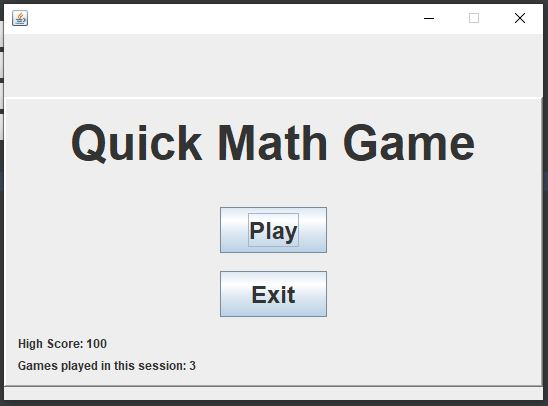
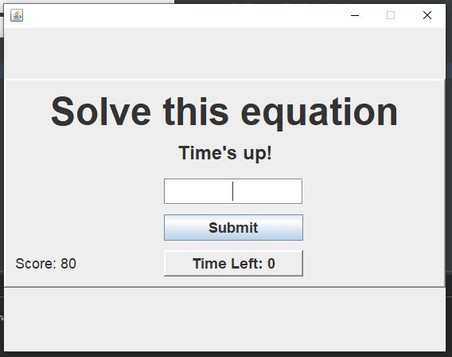
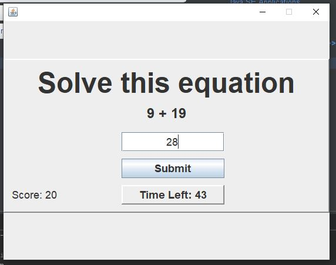
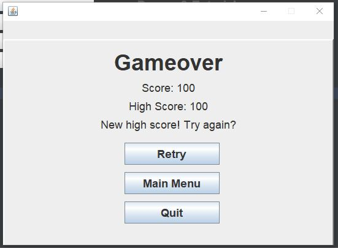
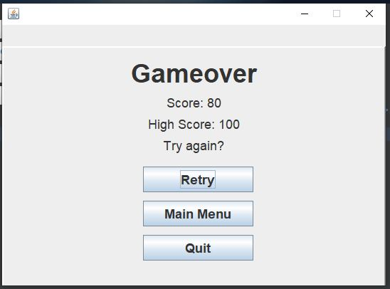

# QuickMath

## Description

Just a small desktop GUI app for one of my programming subjects in school. It's a simple math game where you solve as many equations as possible within a time limit. This app saves your high score in a session and records how many times you've played the game in a session.

## Note

This is my first time using Java Swing, and it was mainly for the purpose of a school project where we create a simple GUI app in Java.

## Images of the App

### Main Menu

### Game Screen

### Retry Menu

